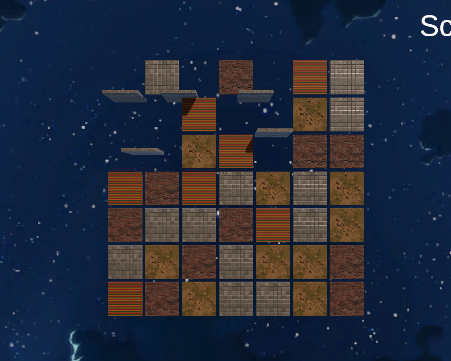

# Unity6Exploration
How to Play: https://github.com/user-attachments/assets/9164e8cc-5255-43ab-abe7-5b7a76c52bcb
just fire up the following link on itch and start playing on browser. https://adipadithedawg.itch.io/grid-matcher

Setup Instructions: pull the project from this github repo and run on Unity6 to avoid any dependency issues. but all are pre-existing
libraries so it shouldn't cause any issues in previous versions. inside the unity6 project there are Assets, Libraries, Packages and Build WebGL. access any of them to see the work i've done

Challenges and Solutions: 

i was having problems getting the logic right of spawning tiles after 2 are destroyed and the rotation was also looking mega goofy
but i got that sorted and have mentioned the solutions in the comments of my scripts. basically used the quaternion rotation of my original
tile prefab and fed it to the new tile spawned in one of the parameters so it spawns in the way i want it to

External Resources: The grid system foundation was created using a course on udemy by code monket for a turn based combat strategy game.
i was working on it before so i just refactored the grid logic so it can be used along with this project while following clean code guidelines
and help from chatGPT. for the materials i used textures from freepbr.com and just made materials optimized for unity URP out of those
